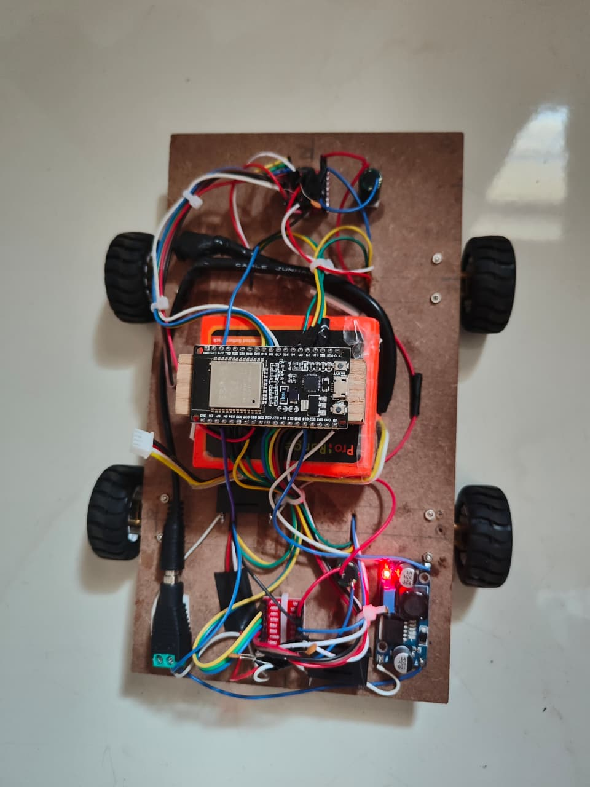
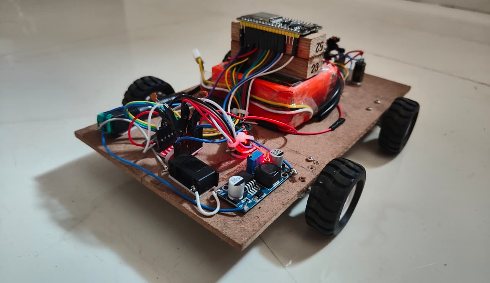
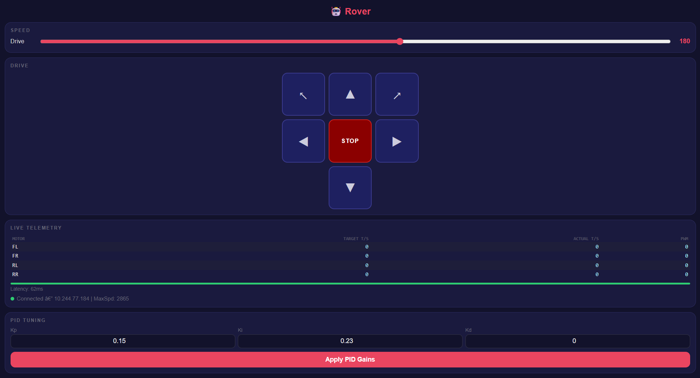
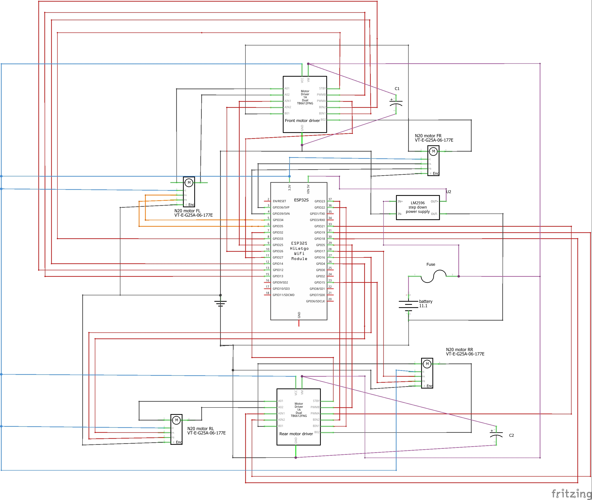

# 🤖 ESP32 4WD Rover — WiFi Web Control + PID

A 4-wheel drive rover controlled wirelessly from any browser over WiFi, with real-time PID motor speed control, live telemetry, and OTA firmware updates — all running on a single **ESP32**.

---

## 📹 Demo Video

[](YOUR_YOUTUBE_LINK_HERE)

---

## 📸 Project Photos

| Top View | Side View |
|:--------:|:---------:|
|  |  |

| Web Interface |
|:-------------:|
|  |

| Wiring / Connections |
|:--------------------:|
|  |

---

## 📌 Overview

This project implements a browser-controlled 4WD differential drive rover with:

- A **WiFi HTTP web server** running entirely on the ESP32
- A **touch-friendly D-pad UI** served to any phone or laptop on the same network
- **Independent PID control** on all four N20 encoder motors for smooth, consistent movement
- **Live telemetry** showing real-time target speed, actual speed, and PWM for every motor
- **Live PID gain tuning** from the browser — no re-flashing needed
- **OTA (Over-The-Air) firmware updates** — after first upload, re-flash wirelessly

---

## ✨ Features

- 🎮 Browser-based D-pad controller (works on mobile and desktop)
- 📐 Differential drive mixing with proportional turn scaling
- 🔄 Independent PID loop per wheel (20 Hz update rate)
- 📊 Live telemetry: target ticks/s, actual ticks/s, PWM per motor
- 🎛️ Live PID gain adjustment from the web UI
- 📡 OTA firmware updates over WiFi
- 🔧 Built-in encoder calibration routine via Serial
- 🛡️ Anti-windup PID integrator clamping
- ⚡ IRAM-placed encoder ISRs for reliable interrupts during WiFi activity

---

## 🛠️ Technologies Used

### Hardware

| Component | Details |
|-----------|---------|
| ESP32 Dev Board | Main microcontroller — WiFi, web server, PID |
| N20 Encoder Motors (×4) | Geared DC motors with built-in quadrature encoders |
| TB6612FNG H-Bridge (×2) | Dual motor driver — front pair + rear pair |
| 4WD Rover Chassis | Aluminium/acrylic frame with 4 wheels |
| Li-Po / Li-ion Battery | Power supply for motors and ESP32 |
| Breadboard & Jumper Wires | Prototyping connections |

### Software & Libraries

| Library | Purpose |
|---------|---------|
| `WiFi.h` | WiFi station mode connection |
| `WebServer.h` | HTTP server for web UI and API |
| `ArduinoOTA.h` | Over-the-air firmware updates |

> All libraries are included in the **ESP32 Arduino Core** — no external installs needed.

### Arduino Core Requirement
This firmware uses the **ESP32 Arduino Core 3.x** timer API (`timerBegin(1000000)`).
The older Core 2.x 3-argument API is deprecated and will break silently — ensure you are on Core 3.x.

---

## 🏗️ System Architecture

```
Browser (Phone / Laptop)
        ↓  HTTP over WiFi
ESP32 Web Server  ←→  /drive  /stop  /pid  /status
        ↓
PID Controller (20 Hz)
   ├── Motor FL ←→ Encoder FL (ISR)
   ├── Motor FR ←→ Encoder FR (ISR)
   ├── Motor RL ←→ Encoder RL (ISR)
   └── Motor RR ←→ Encoder RR (ISR)
        ↓
TB6612FNG H-Bridge Drivers (×2)
        ↓
N20 Encoder Motors (×4)
```

---

## 🔌 Hardware Connections

### Motor Driver → ESP32

| Motor | PWM Pin | IN1 | IN2 |
|-------|---------|-----|-----|
| Front-Left (FL) | 27 | 25 | 26 |
| Front-Right (FR) | 13 | 14 | 12 |
| Rear-Left (RL) | 21 | 18 | 19 |
| Rear-Right (RR) | 5 | 22 | 23 |

| Signal | ESP32 Pin |
|--------|-----------|
| STBY (Front Driver) | 33 |
| STBY (Rear Driver) | 32 |

### Encoder → ESP32

| Encoder | Channel A | Channel B |
|---------|-----------|-----------|
| FL | 34 | 35 |
| FR | 36 (SVP) | 39 (SVN) |
| RL | 4 | 16 |
| RR | 17 | 15 |

> ⚠️ Pins 34, 35, 36, 39 are **input-only** on ESP32 — no internal pull-ups available. Use external pull-up resistors or rely on the encoder's own output stage.

---

## 📁 Repository Structure

```
ESP32-4WD-Rover/
│
├── README.md
├── .gitignore
│
├── Firmware/
│   └── Esp32_PID_4wd_control/
│       └── Esp32_PID_4wd_control.ino   ← Main sketch (WiFi + PID + Web UI)
│
├── Images/
│   ├── top_view.jpeg
    ├── side_view.jpeg
    ├── connections.jpeg
    └── web_interface.png
```

---

## ⚙️ Installation & Setup

### 1. Clone the Repository

```bash
git clone https://github.com/YOUR_USERNAME/ESP32-4WD-Rover.git
cd ESP32-4WD-Rover
```

### 2. Install ESP32 Arduino Core

In Arduino IDE → **File → Preferences → Additional Board Manager URLs**, add:

```
https://raw.githubusercontent.com/espressif/arduino-esp32/gh-pages/package_esp32_index.json
```

Then go to **Tools → Board → Boards Manager** and install **esp32 by Espressif Systems** (version 3.x).

### 3. Configure WiFi Credentials

Open `Firmware/Esp32_PID_4wd_control/Esp32_PID_4wd_control.ino` and update:

```cpp
const char* WIFI_SSID     = "YOUR_WIFI_SSID";
const char* WIFI_PASSWORD = "YOUR_WIFI_PASSWORD";
const char* OTA_PASSWORD  = "YOUR_OTA_PASSWORD";
```

### 4. Upload via USB (First Time)

- Select board: **ESP32 Dev Module**
- Select the correct COM port
- Click **Upload**
- Open **Serial Monitor** at **115200 baud**
- The IP address will be printed once connected to WiFi

### 5. Open the Web Interface

On any device connected to the **same WiFi network**, open a browser and go to:

```
http://[IP shown in Serial Monitor]
```

---

## 🎮 Using the Web Interface

| Section | Description |
|---------|-------------|
| **Speed sliders** | Adjust drive speed and turn speed independently |
| **D-pad** | Hold buttons to move — release to stop. Supports diagonal movement |
| **Live Telemetry** | Real-time target speed, actual encoder speed, and PWM per motor |
| **PID Tuning** | Change Kp, Ki, Kd live and apply without re-flashing |

---

## 📡 OTA Firmware Updates

After the first USB upload, all future uploads can be done wirelessly:

1. In Arduino IDE go to **Tools → Port → Network Ports**
2. Select **esp32-rover** from the list
3. Click Upload as normal
4. Enter the OTA password when prompted

> Motors are automatically stopped before any OTA flash operation for safety.

---

## 🔧 Encoder Calibration

The `MAX_SPEED_TICKS` constant must match your actual motor speed for the PID to work accurately.

1. Lift the rover so wheels are off the ground
2. Open Serial Monitor at 115200
3. Type `M` and press Enter
4. The RL motor runs at full speed for 3 seconds and prints average ticks/sec
5. Copy the printed value into `MAX_SPEED_TICKS` in the sketch and re-upload

> The default value of `2865.0` was measured from the N20 motors used in this build. Your motors may differ.

---

## 🔄 PID Tuning Guide

Each wheel has its own independent PID controller. Tune using this procedure:

| Step | Action |
|------|--------|
| 1 | Set `Ki=0`, `Kd=0`. Increase `Kp` until responsive but not oscillating. Start at `1.0` |
| 2 | Add small `Ki` (try `0.5`) to eliminate steady-state speed error |
| 3 | If overshooting on direction change, add small `Kd` (try `0.05`) |

Gains can be changed **live** from the web interface PID panel — no re-flash needed.

**Verified working values for this build:** `Kp=0.15 | Ki=0.23 | Kd=0.00`

---

## 🔄 Workflow

```
Power on ESP32
      ↓
Connect to WiFi → print IP to Serial
      ↓
Start Web Server + OTA listener
      ↓
User opens browser → http://[IP]
      ↓
Hold D-pad button → /drive request sent every 150ms
      ↓
ESP32 receives linear + angular values
      ↓
Differential mixing → left/right speed targets
      ↓
PID loop (20Hz) reads encoders → adjusts PWM
      ↓
TB6612FNG drives N20 motors
      ↓
Release button → /stop → motors halt
```

---

## 📚 Learning Outcomes

- ESP32 WiFi station mode and HTTP web server
- Embedded PID control with anti-windup
- Quadrature encoder reading via hardware interrupts
- Differential drive kinematics and mixing
- IRAM-placed ISRs for interrupt reliability during WiFi
- OTA firmware updates with ArduinoOTA
- Responsive HTML/CSS/JS UI served from microcontroller flash
- H-bridge motor driver (TB6612FNG) control

---

## 🚀 Future Improvements (ARIA Roadmap)

- [ ] Autonomous navigation with ultrasonic / LiDAR sensors
- [ ] Raspberry Pi 4B integration for on-device LLM voice control
- [ ] ROS2 compatibility
- [ ] SLAM-based indoor mapping
- [ ] Web dashboard with movement history and speed graphs
- [ ] Mobile app controller

---

## 👥 Team

**Mayank Jain** — Firmware, PID, Hardware  
IoT, Robotics and Automation Enthusiast

[](https://github.com/MayankJain-22)

---

## 📄 License

This project is shared for educational and learning purposes.
